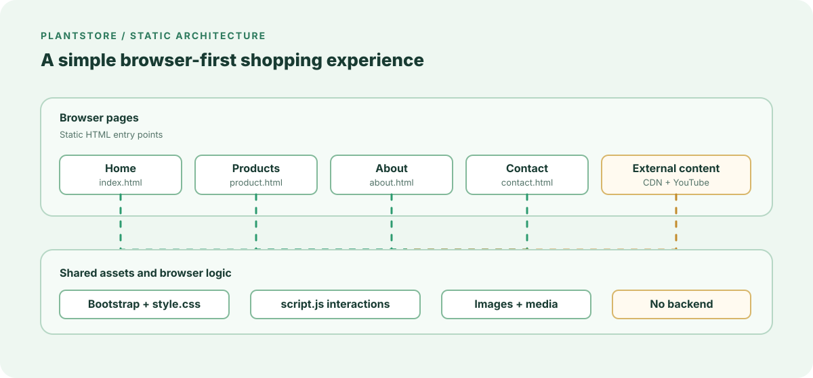

<div align="center">

# PlantStore

**A responsive static storefront for discovering, exploring, and caring for houseplants.**


</div>

## Contents

- [Description](#description)
- [Key Features](#key-features)
- [Tech Stack](#tech-stack)
- [Getting Started](#getting-started)
  - [Prerequisites](#prerequisites)
  - [Installation](#installation)
  - [Run](#run)
- [Environment Variables](#environment-variables)
- [Architecture](#architecture)
- [Page-by-Page Setup and Usage](#page-by-page-setup-and-usage)
  - [1. Home Page](#1-home-page)
  - [2. Products Page](#2-products-page)
  - [3. About Page](#3-about-page)
  - [4. Contact Page](#4-contact-page)
- [Tools and Shared Assets](#tools-and-shared-assets)
  - [Bootstrap](#bootstrap)
  - [Custom CSS](#custom-css)
  - [JavaScript Tools](#javascript-tools)
  - [Font Awesome](#font-awesome)
  - [YouTube Embed](#youtube-embed)
  - [Animated Architecture SVG](#animated-architecture-svg)
- [Planned Alternatives](#planned-alternatives)
- [License](#license)

## Description

PlantStore is a browser-based plant shop experience for home gardeners, first-time plant owners, and anyone looking for practical plant-care inspiration. It provides a clear path from browsing popular houseplants to comparing basic care preferences, learning about the store, and contacting the team.

The project is intentionally lightweight: it runs as a static site with no backend, database, account system, or payment processing.

## Key Features

- **Responsive storefront:** Browse the site across desktop, tablet, and mobile layouts using Bootstrap's responsive grid.
- **Plant discovery:** Explore popular houseplants including Snake Plant, Fiddle Leaf Fig, and a succulent collection.
- **Plant Matchmaker:** Choose sunlight, care, and pet-friendliness preferences on the home page to begin a plant search.
- **Care guidance:** Review watering, sunlight, drainage, soil, and placement tips on the Products page.
- **Contact workflow:** Submit contact details through the Contact page's client-side form interaction.
- **Live chat demo:** Open the floating chat widget and receive a simulated response in the browser.
- **Store information:** Read the PlantStore mission, team, and eco-friendly sourcing details.
- **Local asset support:** Keep custom styles, JavaScript, images, and Bootstrap distribution files organized in the repository.

## Tech Stack

| Technology         | Purpose                                                         |
| ------------------ | --------------------------------------------------------------- |
| HTML5              | Page structure and semantic content                             |
| CSS3               | Custom layout, hero backgrounds, hover states, and chat styling |
| JavaScript (ES6+)  | Date/time display, alerts, and simulated live chat              |
| Bootstrap 5.3.3    | Responsive layout and UI utilities                              |
| Font Awesome 6.7.2 | Contact-page icons, loaded from CDN                             |
| YouTube Embed      | Succulent video content on the storefront                       |

## Getting Started

### Prerequisites

- A modern browser such as Chrome, Edge, Firefox, or Safari.
- XAMPP with the Apache module installed.
- Git, if cloning the repository.

### Installation

```bash
git clone <repository-url>
cd Online-Plant-Store
```

No package installation or build step is required. Bootstrap is already available under `vendor/bootstrap-5.3.3/`; some pages also reference CDN-hosted Bootstrap and Font Awesome assets.

For XAMPP, place the project folder inside Apache's document root:

```text
C:\xampp\htdocs\Online-Plant-Store
```

If you cloned the repository elsewhere, copy the complete `Online-Plant-Store` folder, including `index.html`, `assets/`, and `vendor/`, into `C:\xampp\htdocs\`.

### Run

1. Open the **XAMPP Control Panel**.
2. Select **Start** next to **Apache**.
3. Confirm that Apache is running. The default port is `80`.
4. Open the project in your browser:

```text
http://localhost/Online-Plant-Store/
```

The homepage should load from `index.html`. You can also open each page directly:

```text
http://localhost/Online-Plant-Store/index.html
http://localhost/Online-Plant-Store/product.html
http://localhost/Online-Plant-Store/about.html
http://localhost/Online-Plant-Store/contact.html
```

If Apache uses a different port, include that port in the URL, for example:

```text
http://localhost:8080/Online-Plant-Store/
```

To stop the local server, return to the XAMPP Control Panel and select **Stop** next to Apache. MySQL is not required because this project has no backend or database.

## Environment Variables

This version has no environment variables. It is a client-only static site and does not connect to a backend service.

```env
# No environment variables required
```

## Architecture

The application is organized as a small, shared-asset static site. The animated diagram below uses SVG vectors and CSS keyframe animations to create moving line effects without sacrificing image quality. It is a standalone browser-renderable asset at [`assets/architecture.svg`](assets/architecture.svg).

<p align="center">
	
</p>

| Layer               | Responsibility                                                               | Main files                                                 |
| ------------------- | ---------------------------------------------------------------------------- | ---------------------------------------------------------- |
| Pages               | Present storefront, product, company, and contact experiences                | `index.html`, `product.html`, `about.html`, `contact.html` |
| Shared presentation | Provide responsive layout, hero sections, cards, navigation, and chat styles | `assets/css/style.css`, Bootstrap                          |
| Client interactions | Update the clock, show alerts, toggle chat, and simulate bot replies         | `assets/js/script.js`                                      |
| Media               | Supply plant, team, and banner imagery                                       | `assets/images/`                                           |
| External content    | Load selected CDN libraries and embedded video content                       | Bootstrap CDN, Font Awesome CDN, YouTube                   |

## Page-by-Page Setup and Usage

Use the pages in this order when evaluating the site: start at Home, inspect products, read the company information, and finish with Contact. Every page shares the same navigation and custom stylesheet, so a page can be opened directly after the local server is running.

### 1. Home Page

File: [`index.html`](index.html)

The Home page is the entry point. It contains the PlantStore hero section, a live date and time display, the Plant Matchmaker controls, feature highlights, company introduction, popular plants, care guides, and the Blooming Oasis mission statement.

#### Open the Home page

```text
1. Start the local server from the repository root.
2. Open http://localhost:8000/index.html.
3. Confirm that the hero image, navigation, plant cards, and current date/time are visible.
4. Use the navigation links to move to Products, About, or Contact.
```

#### Use the Plant Matchmaker

```text
1. Find the Plant Matchmaker section.
2. Select a sunlight value: Low Light, Medium Light, or Bright Light.
3. Select a care level: Easy, Moderate, or Advanced.
4. Select a pet-friendliness value: Yes or No.
5. Select Find Plants.
```

The current form is a visual interaction only. It does not calculate or display filtered results yet.

### 2. Products Page

File: [`product.html`](product.html)

The Products page presents plant discovery and care content. It includes preference controls for sunlight, plant size, and water frequency, cards for Snake Plant, Fiddle Leaf Fig, and the Succulent Collection, plus care tips with file inputs.

#### Browse products and care tips

```text
1. Open http://localhost:8000/product.html.
2. Select values under Requirements.
3. Select Find Plants to return to the Products page.
4. Review a plant card and select Add to cart.
5. Read the Snake Plant and Fiddle Leaf Fig care tips.
6. Choose a local file in a care-tip file input and select Send.
```

The Add to cart and Send controls currently show browser alerts. They do not create a cart, upload a file, or persist data.

### 3. About Page

File: [`about.html`](about.html)

The About page explains the store identity and mission. It includes the team, plant-care expertise, eco-friendly packaging, and responsible cultivation content, supported by images from `assets/images/`.

#### Read the company information

```text
1. Open http://localhost:8000/about.html.
2. Review the hero message and the Who We Are section.
3. Read Our Mission and inspect the supporting plant images.
4. Review the three team profiles.
5. Read the Eco-Friendly Sourcing Practices section.
```

This page is informational and does not require JavaScript input or configuration.

### 4. Contact Page

File: [`contact.html`](contact.html)

The Contact page provides a demo contact form, phone and email links, a physical address, and a floating live-chat widget. It loads both `assets/css/style.css` and `assets/js/script.js`.

#### Submit the contact demo

```text
1. Open http://localhost:8000/contact.html.
2. Enter a full name in the Name field.
3. Enter an email address in the Email Address field.
4. Enter a subject and message.
5. Select Send Message.
6. Dismiss the browser confirmation alert.
```

#### Use the live-chat demo

```text
1. Select the floating chat button in the lower-right corner.
2. Type a message in the chat input.
3. Select Send.
4. Read the message added to the chat box.
5. Wait briefly for the simulated Hello! How can I help? response.
6. Select the close control to hide the chat panel.
```

The contact form and chat are local demonstrations. Messages are not sent to support, stored, or connected to an API.

## Tools and Shared Assets

The following tools are already configured in the repository. No package manager command is required for the current implementation.

### Bootstrap

Bootstrap supplies the responsive grid, navbar, spacing utilities, forms, buttons, cards, and layout helpers used throughout the pages.

```html
<!-- External Bootstrap stylesheet used by the HTML pages -->
<link
  href="https://cdn.jsdelivr.net/npm/bootstrap@5.3.0-alpha3/dist/css/bootstrap.min.css"
  rel="stylesheet"
/>

<!-- Bootstrap distribution also available locally -->
<link rel="stylesheet" href="vendor/bootstrap-5.3.3/css/bootstrap.min.css" />
<script src="vendor/bootstrap-5.3.3/js/bootstrap.bundle.min.js"></script>
```

The current pages reference the CDN stylesheet and CDN JavaScript. The local Bootstrap distribution remains available under `vendor/bootstrap-5.3.3/` for offline or self-hosted setup.

### Custom CSS

File: [`assets/css/style.css`](assets/css/style.css)

The stylesheet adds hero background images, page-specific hero classes, navigation hover states, plant-tip hover behavior, date/time styling, and the fixed live-chat layout.

```html
<!-- Include after Bootstrap so project styles can override defaults -->
<link rel="stylesheet" href="assets/css/style.css" />
```

Keep this stylesheet path relative to each root-level HTML page. If the pages are moved into a subdirectory, update the relative asset paths accordingly.

### JavaScript Tools

File: [`assets/js/script.js`](assets/js/script.js)

The shared script exposes small browser utilities used by the pages:

| Function                | Used for            | Current behavior                                        |
| ----------------------- | ------------------- | ------------------------------------------------------- |
| `showUpdatedDateTime()` | Home page clock     | Writes a localized date/time into `#dateTime`           |
| `showAlert()`           | Contact page form   | Shows a confirmation alert                              |
| `giveAlert()`           | Optional alert hook | Shows the same confirmation alert                       |
| `toggleChat()`          | Contact page chat   | Opens or closes `#chatContainer`                        |
| `sendMessage()`         | Contact page chat   | Adds a user message and schedules a simulated bot reply |
| `displayMessage()`      | Chat rendering      | Appends and scrolls to a chat message                   |

```html
<!-- Place after the page markup so referenced elements exist -->
<script src="assets/js/script.js"></script>
```

The script expects matching element IDs such as `dateTime`, `chatContainer`, `chatBox`, and `messageInput`. Do not load it before the page markup unless the initialization logic is updated.

### Font Awesome

Font Awesome provides the phone, envelope, map-marker, seedling, leaf, and truck icons. It is currently loaded on the Contact page from cdnjs.

```html
<link
  rel="stylesheet"
  href="https://cdnjs.cloudflare.com/ajax/libs/font-awesome/6.7.2/css/all.min.css"
/>
```

Icons are rendered with classes such as `fas fa-phone` and `fas fa-envelope`. A network connection is needed for the CDN version to display.

### YouTube Embed

The popular-plants sections embed a YouTube video for the Succulent Collection.

```html
<iframe
  src="https://www.youtube.com/embed/ejetprKvOrg"
  title="YouTube video player"
  allowfullscreen
>
</iframe>
```

The video is external content and may be unavailable when network access, browser privacy settings, or YouTube availability prevents embedding.

### Animated Architecture SVG

File: [`assets/architecture.svg`](assets/architecture.svg)

The diagram is a standalone SVG that can be viewed directly in a browser or embedded in Markdown. Its CSS defines animated dashed paths and a reduced-motion fallback.

```html

```

Open `assets/architecture.svg` directly to inspect the vector diagram. No JavaScript, build tool, or image conversion step is required.

The current forms and cart controls are demonstrations. They do not persist submissions, create orders, upload files, or send network requests to a store backend.

## Planned Alternatives

The following production capabilities are not included in this static implementation but are natural next steps:

- **Catalog API and database:** Load inventory, prices, stock, and care metadata dynamically.
- **Real search and filtering:** Filter by light, size, watering frequency, pet safety, price, and availability.
- **Persistent cart and checkout:** Store cart state, calculate shipping, and integrate a payment provider.
- **Authenticated customer accounts:** Save wishlists, addresses, orders, and care reminders.
- **Server-backed contact and chat:** Validate, rate-limit, store, and route messages to a support team.
- **Accessibility and quality automation:** Add automated accessibility checks, browser tests, performance budgets, and image optimization.
- **Offline-ready delivery:** Package the site as a progressive web app with caching and install support.

## License

This project is licensed under the [MIT License](https://opensource.org/licenses/MIT). Add a `LICENSE` file containing the full MIT text when distributing the repository.

[Back to Contents](#contents)


## Contact
- **Project Maintainer:** Mehedi Alam
- **GitHub:** https://github.com/MehediAlam49
- **Repository:** https://github.com/MehediAlam49/WDDF-Online-Plant-Store
- **Email:** [mehedialam806@gmail.com](mailto:mehedialam806@gmail.com)
  
<p align="right"><a href="#contents">Back to Contents</a></p>
